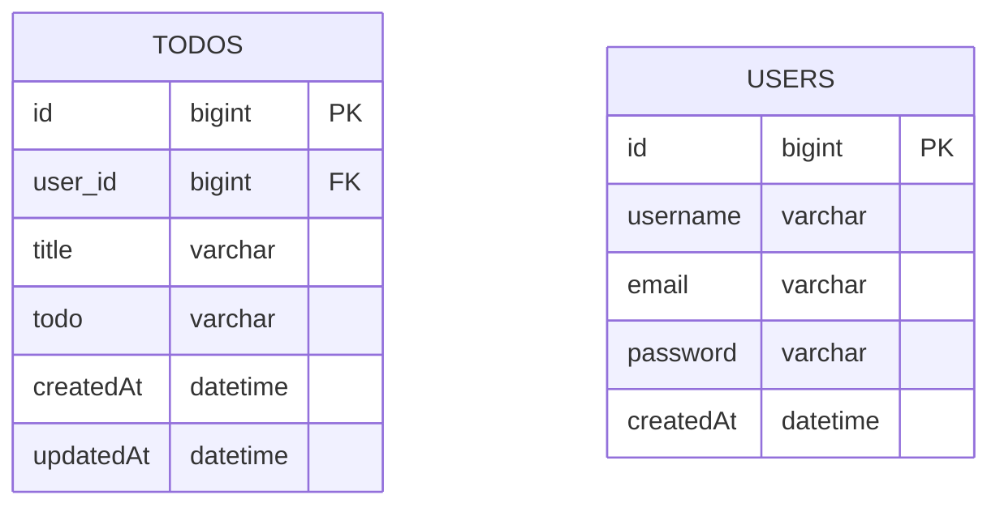

# 일정 관리 앱 Develop
```
dependencies {
	// 웹
	implementation 'org.springframework.boot:spring-boot-starter-web'
	// 롬복
	compileOnly 'org.projectlombok:lombok'
	annotationProcessor 'org.projectlombok:lombok'
	// 개발
	developmentOnly 'org.springframework.boot:spring-boot-devtools'
	// JPA
	implementation 'org.springframework.boot:spring-boot-starter-data-jpa'
	// mysql
	implementation 'mysql:mysql-connector-java:8.0.28'
	// 테스트
	testImplementation 'org.springframework.boot:spring-boot-starter-test'
	testRuntimeOnly 'org.junit.platform:junit-platform-launcher'
	// 유효성검사
	implementation 'org.springframework.boot:spring-boot-starter-validation'
}
```
```
spring.application.name=todoapp-develop

spring.datasource.url=jdbc:mysql://localhost:3306/todo_db
spring.datasource.username=root
spring.datasource.password=****
spring.datasource.driver-class-name=com.mysql.cj.jdbc.Driver

spring.jpa.hibernate.ddl-auto=create
spring.jpa.show-sql=true
spring.jpa.properties.hibernate.format_sql=true
```


```
todoapp.todoapp_develop
│
├── controller
│   ├── AuthController
│   ├── TodoController
│   └── UserController
│
├── domain
│   ├── BaseEntity
│   ├── Todo
│   └── User
│
├── dto
│   ├── requestdto
│   │   ├── LoginRequestDto
│   │   ├── TodoRequestDto
│   │   └── UserRequestDto
│   └── responsedto
│       ├── LoginResponseDto
│       ├── TodoResponseDto
│       └── UserResponseDto
│
├── repository
│   ├── TodoRepository
│   └── UserRepository
│
├── service
│   ├── TodoService
│   └── UserService
│
│
├── Config
│
├── Fliter
│
└── TodoappDevelopApplication

resources
└── application.properties

sql
└── schedule.sql
```

- domain 패키지
  - BaseEntity 는 JPA Auditing 을 활용해서 작성일, 수정일을 자동으로 관리하기 위한 엔티티입니다.
    - 작성일(createdAt) , 수정일(updatedAt) 을 필드로 가집니다.
  - Todo 는 일정 데이터를 관리하기 위한 엔티티입니다.
    - 일정 고유 식별자(id) , 할일 제목(title) , 할일 내용(todo) , 작성 유저(작성 유저명 필드 대신 유저 고유 식별자 user) 를 필드로 가집니다.
  - User 는 유저 데이터를 관리하기 위한 엔티티입니다.
    - 유저 고유 식별자(id) , 유저명(username) , 이메일(email), 비밀번호(password) 를 필드로 가집니다.

- controller 패키지
  - TodoController 클래스는 일정 관련 로직의 요청을 처리하는 컨트롤러입니다.
    - 일정 생성(createTodo) , 전체 일정 조회(getAllTodos) , 선택 일정 조회(getTodo) , 일정 수정(updateTodo) , 일정 삭제(deleteTodo)
  - UserController 클래스는 유저 관련 로직의 요청을 처리하는 컨트롤러입니다.
    - 유저 생성(createUser) , 전체 유저 조회(getAllUsers) , 선택 유저 조회(getUser) , 유저 수정(updateUser) , 유저 삭제(deleteUser)
  - AuthController 클래스는 로그인,로그아웃 요청을 처리하는 컨트롤러입니다.
    - 로그인(login) , 로그아웃(logout)
   
- service 패키지
  - TodoService , UserService 클래스는 각각 일정, 유저에 관한 비즈니스 로직을 처리하는 계층입니다.

- repository 패키지
  - TodoRepository , UserRepository 인터페이스는 각각 일정 , 유저에 관한 데이터베이스와 직접적으로 상호작용하는 계층입니다.

- dto 패키지
  - 일정,유저,로그인 로직을 수행하는 데에 필요한 객체들을 requestdto , responsedto 로 분리하여 담아놨습니다.

- Config , Fliter

- schedule.sql
  - 테이블 생성에 필요한 query 를 작성하는 파일 입니다.


# API 명세서

유저
|기능|메서드|URL|Request Body(JSON)|Response Body(JSON)|
|------|---|---|---|---|
|유저 생성|POST|/api/users|{"username", "password", "email"}|{"id", "username", "email", "createdAt"}|
|전체 유저 조회|GET|/api/users|없음|{"id", "username", "email", "createdAt"}|
|선택 유저 조회|GET|/api/users/{id}|없음|{"id", "username", "email", "updatedAt"}|  
|유저 수정|PUT|/api/users/{id}|{"username", "password", "email"}|{"id", "username", "email", "createdAt"}|
|유저 삭제|DELETE|/api/users/{id}|없음|"유저가 삭제되었습니다."|


일정
|기능|메서드|URL|Request Body(JSON)|Response Body(JSON)|
|------|---|---|---|---|
|일정 생성|POST|/api/todos|{"userId", "title", "todo"}|{"id", "username", "title", "todo", "createdAt", "updatedAt"}|
|전체 일정 조회|GET|/api/todos|없음|{"id", "username", "title", "todo", "createdAt", "updatedAt"}|
|선택 일정 조회|GET|/api/todos/{id}|없음|{"id", "username", "title", "todo", "createdAt", "updatedAt"}|  
|일정 수정|PUT|/api/todos/{id}|{"title", "todo"}|{"id", "username", "title", "todo", "createdAt", "updatedAt"}|
|일정 삭제|DELETE|/api/todos/{id}|없음|"일정이 삭제되었습니다."|

로그인
|기능|메서드|URL|Request Body(JSON)|Response Body(JSON)|
|------|---|---|---|---|
|로그인|POST|/api/auth/login|{"email", "password"}|{"message", "username"}|
|로그아웃|POST|/api/auth/logout|없음|{"로그아웃 되었습니다."}|


1. `POST` 유저 생성 (http://localhost:8080/api/users)
```
-------요청
{
    "username": "minjae",
    "password": "0000",
    "email": "minjae@example.com"
}
-------응답
{
    "id": 1,
    "username": "minjae",
    "email": "minjae@example.com",
    "createdAt": ***
}
```

2. `GET` 유저 조회 (http://localhost:8080/api/users/1)
```
-------응답
{
    "id": 1,
    "username": "minjae",
    "email": "minjae@example.com",
    "createdAt": ***
}
```
 
3. `POST` 일정 생성 (http://localhost:8080/api/todos)
```
-------요청
{
    "userId": "1",
    "title": "sleep",
    "todo": "good sleep"
}
--------응답
{
    "id": 1,
    "username": "minjae",
    "title": "sleep",
    "todo": "good sleep",
    "createdAt": ***,
    "updatedAt": ***
}
```

4. `GET` 일정 조회(http://localhost:8080/api/todos/1)
```
--------응답
{
    "id": 1,
    "username": "minjae",
    "title": "sleep",
    "todo": "good sleep",
    "createdAt": ***,
    "updatedAt": ***
}
```

5. `PUT` 유저 수정(http://localhost:8080/api/users/1)
```
-------요청
{
    "username": "hungry minjae",
    "password": "0000",
    "email": "minjae@example.com"
}
--------응답
{
    "id": 1,
    "username": "hungry minjae",
    "email": "minjae@example.com",
    "createdAt": ***
}
```

6. `PUT` 일정 수정(http://localhost:8080/api/todos/1)
```
------요청
{
    "title": "meal",
    "todo": "eat"
}
------응답
{
    "id": 1,
    "username": "hungry minjae",
    "title": "meal",
    "todo": "eat",
    "createdAt": ***,
    "updatedAt": ***
}
```
7. `POST` 로그인(http://localhost:8080/api/auth/login)
```
------요청
{
    "email": "minjae@example.com",
    "password": "0000"
}
------응답
{
    "message": "로그인 성공",
    "username": "hungry minjae"
}
```

8. `POST` 로그아웃(http://localhost:8080/api/auth/logout)
```
------응답
로그아웃 되었습니다.
```

9. `DELETE` 일정 삭제(http://localhost:8080/api/todos/1)
```
-------응답
일정이 삭제되었습니다.
```

10. `DELETE` 유저 삭제(http://localhost:8080/api/users/1)
```
-------응답
유저가 삭제되었습니다.
```


# ERD



# MySQL 테이블 생성 쿼리 (schedule.sql)
```
CREATE TABLE TODOS (
id BIGINT AUTO_INCREMENT PRIMARY KEY
user_id BIGINT NOT NULL
title VARCHAR(255) NOT NULL
todo  VARCHAR(255) NOT NULL
createdAt TIMESTAMP DEFAULT CURRENT_TIMESTAMP
updatedAt TIMESTAMP DEFAULT CURRENT_TIMESTAMP ON UPDATE CURRENT_TIMESTAMP
);

CREATE TABLE USERS (
id BIGINT AUTO_INCREMENT PRIMARY KEY
username VARCHAR(255) NOT NULL
email  VARCHAR(255) NOT NULL
password VARCHAR(255) NOT NULL
createdAt TIMESTAMP DEFAULT CURRENT_TIMESTAMP
);
```
